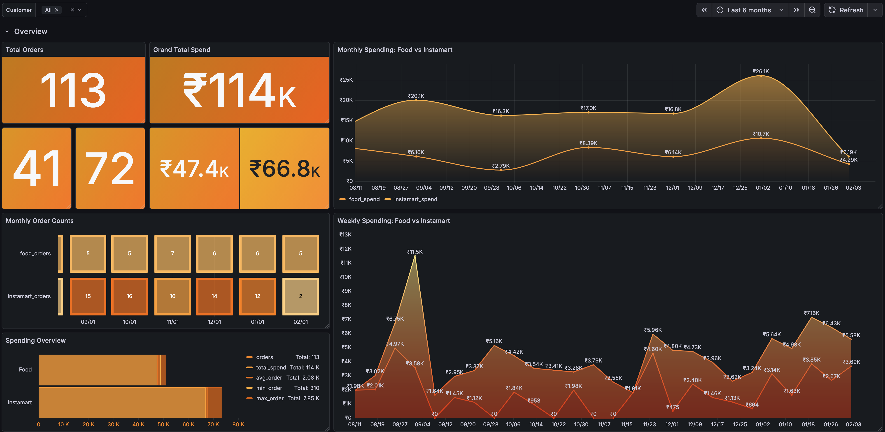
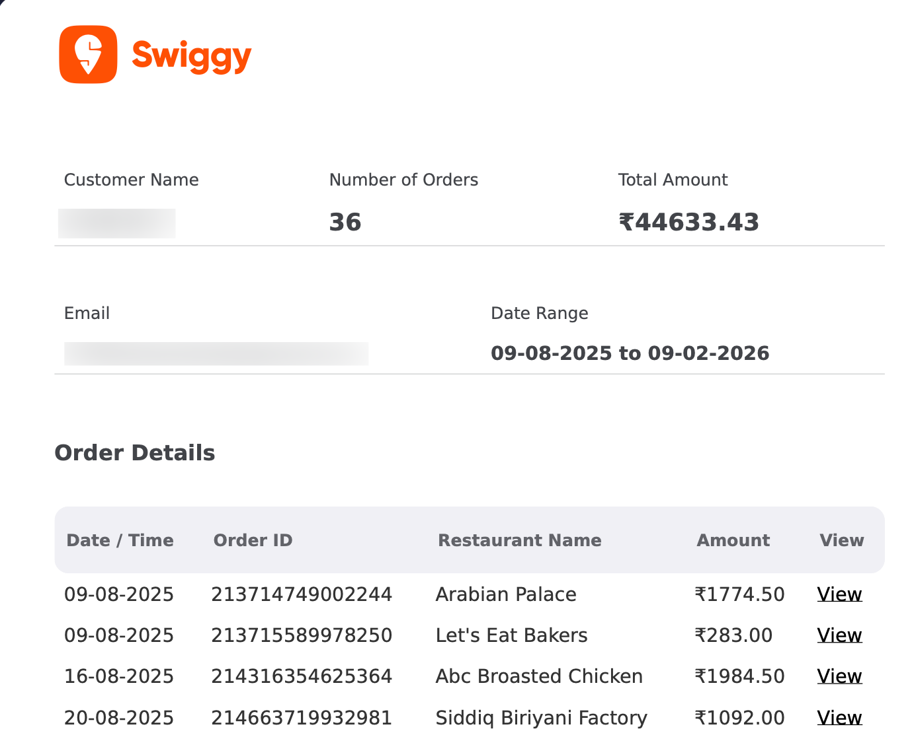
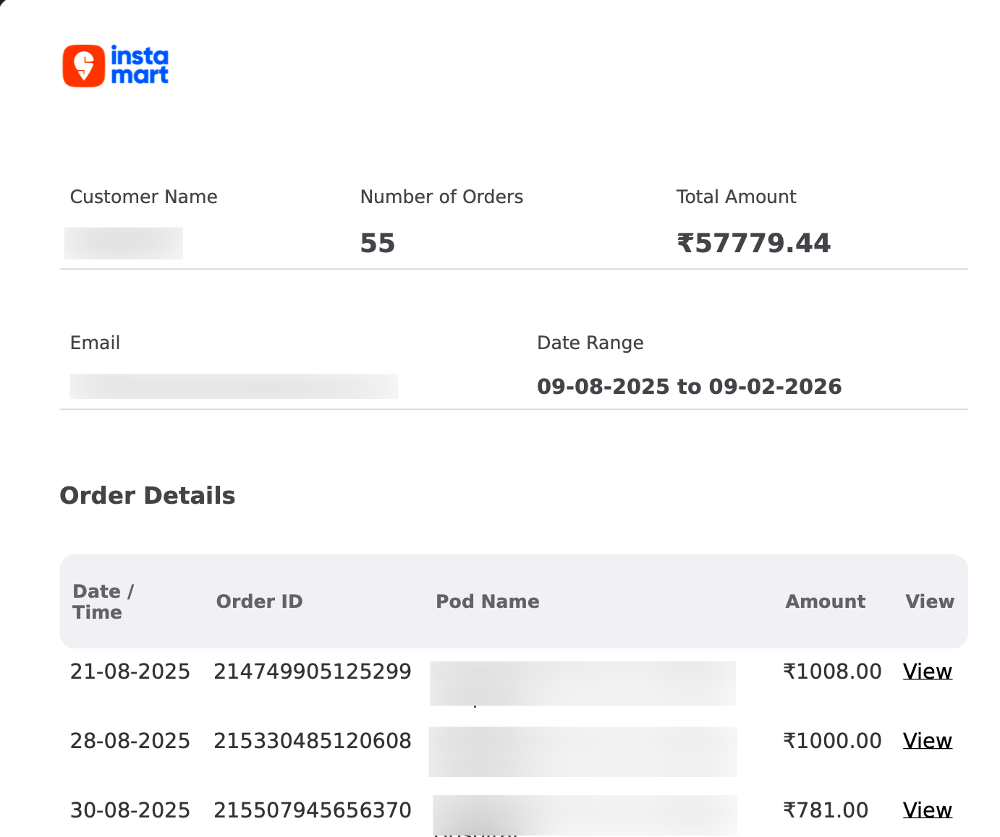
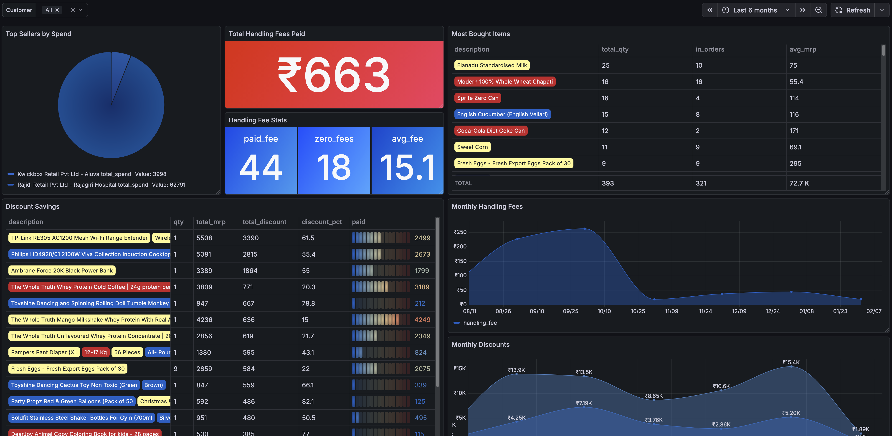
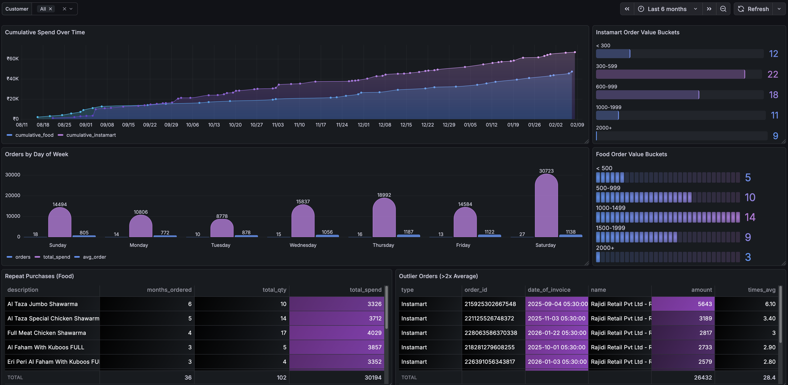

# SwiggyIt

Parse your Swiggy Food and Instamart PDF bills, store structured data in PostgreSQL, and visualize your spending with pre-built Grafana dashboards.



## What It Does

- Extracts order data from Swiggy-exported summary PDFs (Food + Instamart)
- Downloads detailed invoices via embedded PDF hyperlinks
- Parses every field: items, prices, discounts, per-item taxes (HSN, CGST, SGST), handling fees
- Loads everything into PostgreSQL with full upsert support (safe to re-run)
- Provides a Grafana dashboard with 30+ panels for spending analysis
- Supports multiple users (e.g., family members) from separate PDF exports

## Getting Your Swiggy Reports

Swiggy provides account statements as PDF summaries. Here's how to request them:

1. Open the **Swiggy app** and tap your **Profile** icon
2. Select **Account Statements**
3. Select the **Duration** (maximum 6 months per request)
4. Select the **Category** — Food or Instamart
5. Tap **Get Report** — takes approximately 3 hours to arrive via email




> **Note:** The summary PDF contains a header with totals, followed by a table of orders. Each order has a "View" link pointing to the detailed invoice PDF. SwiggyIt automatically downloads and parses all linked detail invoices.

You'll need to request separate reports for **Food** and **Instamart**. If you want more than 6 months of history, request multiple reports with different date ranges — SwiggyIt handles deduplication automatically.

## Prerequisites

- [Docker](https://docs.docker.com/get-docker/) and Docker Compose

## Quick Start

### 1. Clone and configure

```bash
git clone https://github.com/<your-username>/swiggyit.git
cd swiggyit

cd deploy
cp .env.example .env
# Edit .env and set your passwords
```

### 2. Start PostgreSQL

```bash
cd deploy
docker compose up -d postgres
```

The database schema is auto-created on first startup via `sql/schema.sql`.

### 3. Place your exported PDFs

```
input/
├── food/
│   └── order_summary_food_<uuid>.pdf
└── instamart/
    └── order_summary_instamart_<uuid>.pdf
```

### 4. Run the pipeline

**Using Docker (recommended):**

```bash
cd deploy
docker compose run --rm app
```

**Or locally with Python 3.12+:**

```bash
python3 -m venv .venv
source .venv/bin/activate
pip install -r requirements.txt

export POSTGRES_PASSWORD=your_password
python3 src/main.py --input input --tmp .tmp
```

### 5. Output

```
SwiggyIt - Swiggy Bill Parser
========================================
Input dir: /data/input
Temp dir:  /data/.tmp
Database:  connected

[Food] Parsing summary: order_summary_food_<uuid>.pdf
  Customer: John Doe (john@example.com)
  Orders: 36
  Downloading detail PDFs...
  food: 36 downloaded, 0 cached, 0 failed
  Loaded: 36/36 orders (0 failed)

[Instamart] Parsing summary: order_summary_instamart_<uuid>.pdf
  Customer: John Doe (john@example.com)
  Orders: 55
  Downloading detail PDFs...
  instamart: 55 downloaded, 0 cached, 0 failed
  Loaded: 55/55 orders (0 failed)

Done!
```

## Grafana Dashboard

A pre-built Grafana dashboard with 30+ panels visualizes your spending across four sections:

### Start Grafana

```bash
cd deploy
docker compose up -d postgres grafana
```

Open [http://localhost:3000](http://localhost:3000) and log in with `admin` / `admin` (or your configured password from `.env`).

### Overview
Total orders, grand total spend, food vs instamart breakdown, monthly and weekly spending trends.


### Food Analysis
Top restaurants by spend and frequency, most ordered items, most expensive items, tax per restaurant, monthly tax trends.


### Instamart Analysis
Top sellers, most bought items, handling fee breakdown, discount savings, monthly handling fee and discount trends.



### Spending Patterns
Orders by day of week, order value distribution, cumulative spend over time, repeat purchases, outlier detection.



## Re-running

Safe to run multiple times. The pipeline is idempotent:

| Step | Behavior |
|------|----------|
| Download detail PDFs | Skipped if already cached in `.tmp/` |
| Customers | Upserted by email |
| Orders | Upserted by order_id |
| Order items | Deleted and reinserted per order |
| Handling fees | Upserted by order_id |

## Adding Another Person's Bills

Drop their exported PDFs into `input/food/` and `input/instamart/` and re-run. A new customer record is created automatically based on their email from the PDF header. Use the customer filter dropdown in Grafana to switch between users.

## Database Schema

```
customers
  ├── food_orders              → food_order_items
  └── instamart_orders         → instamart_order_items
                               → instamart_handling_fees
```

6 tables capturing every field from the invoices — item descriptions, quantities, unit prices, discounts, per-item tax breakdowns (CGST/SGST/Cess), HSN codes, restaurant/seller GSTIN, FSSAI numbers, and more.

## Project Structure

```
swiggyit/
├── Dockerfile
├── LICENSE
├── README.md
├── requirements.txt
├── pytest.ini
├── deploy/
│   ├── docker-compose.yml        # PostgreSQL + Grafana + app
│   └── .env.example
├── grafana/
│   └── provisioning/
│       ├── datasources/
│       │   └── datasource.yml    # Auto-provisioned PostgreSQL connection
│       └── dashboards/
│           ├── dashboard.yml     # Dashboard provider config
│           └── json/
│               └── swiggyit.json # Combined dashboard (30+ panels)
├── screenshots/                  # Dashboard and bill screenshots
├── sql/
│   ├── schema.sql                # Database DDL (auto-runs on first start)
│   └── analyze.sql               # Standalone analysis queries
├── docs/
│   └── architecture.md           # Detailed design document
├── input/                        # Drop exported PDFs here (gitignored)
│   ├── food/
│   └── instamart/
├── tests/
│   ├── conftest.py
│   ├── test_validator.py
│   ├── test_summary_parser.py
│   ├── test_food_parser.py
│   ├── test_instamart_parser.py
│   ├── test_loader.py
│   ├── test_downloader.py
│   └── test_integration.py       # Requires actual PDFs
└── src/
    ├── main.py                   # CLI entrypoint
    ├── validator.py              # Input validation
    ├── downloader.py             # Fetch detail PDFs from S3 URLs
    ├── loader.py                 # PostgreSQL upsert logic
    └── parser/
        ├── summary_parser.py     # Parse summary PDFs (PyMuPDF)
        ├── food_parser.py        # Parse food invoices (pdfplumber)
        └── instamart_parser.py   # Parse instamart invoices (pdfplumber)
```

## Tech Stack

| Component | Technology |
|-----------|-----------|
| Language | Python 3.12+ |
| PDF link extraction | PyMuPDF (fitz) |
| PDF table parsing | pdfplumber |
| Database | PostgreSQL 17 |
| DB driver | psycopg 3 |
| HTTP client | httpx |
| Infrastructure | Docker Compose |
| Dashboards | Grafana |
| Testing | pytest + pytest-cov |

## CLI Options

```
python3 src/main.py --help

options:
  --input PATH    Input directory with food/ and instamart/ folders (default: input)
  --tmp PATH      Temp directory for downloaded detail PDFs (default: .tmp)
  --db-url URL    PostgreSQL connection URL (default: built from env vars)
```

## Environment Variables

| Variable | Default | Description |
|----------|---------|-------------|
| `POSTGRES_HOST` | `localhost` | Database host |
| `POSTGRES_PORT` | `5432` | Database port |
| `POSTGRES_DB` | `swiggyit` | Database name |
| `POSTGRES_USER` | `swiggyit` | Database user |
| `POSTGRES_PASSWORD` | *(required)* | Database password |
| `GF_ADMIN_USER` | `admin` | Grafana admin username |
| `GF_ADMIN_PASSWORD` | `admin` | Grafana admin password |
| `GRAFANA_PORT` | `3000` | Grafana port |

## Sample Queries

```sql
-- Monthly food spending
SELECT date_trunc('month', date_of_invoice) as month,
       count(*) as orders,
       sum(invoice_total) as total
FROM food_orders
GROUP BY 1 ORDER BY 1;

-- Top restaurants by spend
SELECT restaurant_name, count(*) as orders, sum(invoice_total) as total
FROM food_orders
GROUP BY 1 ORDER BY 3 DESC;

-- Most bought instamart items
SELECT description, sum(quantity) as qty, sum(total_amount) as total
FROM instamart_order_items
GROUP BY 1 ORDER BY 2 DESC LIMIT 10;

-- Total tax paid
SELECT 'Food' as type, sum(total_taxes) as tax FROM food_orders
UNION ALL
SELECT 'Instamart', sum(cgst_amount + sgst_amount + cess_amount)
FROM instamart_order_items;
```

## License

[MIT](LICENSE)
